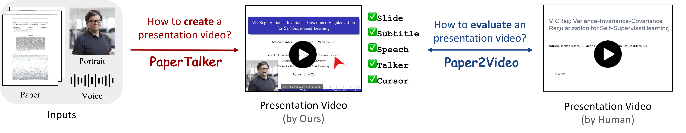

# Paper2Video

<p align="right">
  <a href="./README.md">English</a> | <b>简体中文</b>
</p>


<p align="center">
  <b>Paper2Video: 从学术论文自动生成演讲视频</b>
<br>


<p align="center">
  <a href="https://zeyu-zhu.github.io/webpage/">Zeyu Zhu*</a>,
  <a href="https://qhlin.me/">Kevin Qinghong Lin*</a>,
  <a href="https://scholar.google.com/citations?user=h1-3lSoAAAAJ&hl=en">Mike Zheng Shou</a> <br>
  新加坡国立大学 Show Lab
</p>


<p align="center">
  <a href="https://arxiv.org/abs/2510.05096">📄 论文</a> &nbsp; | &nbsp;
  <a href="https://huggingface.co/papers/2510.05096">🤗 Daily Paper</a> &nbsp; | &nbsp;
  <a href="https://huggingface.co/datasets/ZaynZhu/Paper2Video">📊 数据集</a> &nbsp; | &nbsp;
  <a href="https://showlab.github.io/Paper2Video/">🌐 项目主页</a> &nbsp; | &nbsp;
  <a href="https://x.com/KevinQHLin/status/1976105129146257542">💬 推特</a>
</p>

- **输入:** 一篇论文 ➕ 一张图像 ➕ 一段音频
  
| 论文 | 图像 | 音频 |
|--------|--------|--------|
| <br>[🔗 论文链接](https://arxiv.org/pdf/1509.01626) |  <br>Hinton的图像| <br>[🔗 音频样本](https://github.com/showlab/Paper2Video/blob/page/assets/hinton/ref_audio_10.wav) |


- **输出:** 演讲视频


https://github.com/user-attachments/assets/39221a9a-48cb-4e20-9d1c-080a5d8379c4


查看更多生成结果 [🌐 project page](https://showlab.github.io/Paper2Video/).

## 🔥 Update
**我们欢迎任何贡献！**
- [x] [2025.10.15] 我们更新了一个没有talking-head的新版本，以便快速生成！
- [x] [2025.10.11] 我们的工作在[YC Hacker News](https://news.ycombinator.com/item?id=45553701)上受到关注.
- [x] [2025.10.9] 感谢AK在[Twitter](https://x.com/_akhaliq/status/1976099830004072849)上分享我们的工作!
- [x] [2025.10.9] 我们的工作被 [Medium](https://medium.com/@dataism/how-ai-learned-to-make-scientific-videos-from-slides-to-a-talking-head-0d807e491b27)报道.
- [x] [2025.10.8] 下方查看我们的demo视频!
- [x] [2025.10.7] 我们发布了 [Arxiv 论文](https://arxiv.org/abs/2510.05096).
- [x] [2025.10.6] 我们发布了 [代码](https://github.com/showlab/Paper2Video) and [数据集](https://huggingface.co/datasets/ZaynZhu/Paper2Video).
- [x] [2025.9.28] Paper2Video 已经被 **Scaling Environments for Agents Workshop([SEA](https://sea-workshop.github.io/)) at NeurIPS 2025** 接受.


https://github.com/user-attachments/assets/a655e3c7-9d76-4c48-b946-1068fdb6cdd9


---

### Table of Contents
- [🌟 项目总览](#-项目总览)
- [🚀 快速上手: PaperTalker](#-快速上手-PaperTalker)
  - [1. 环境配置](#1-环境配置)
  - [2. 大语言模型配置](#2-大语言模型配置)
  - [3. 推理](#3-推理)
- [📊 评价指标: Paper2Video](#-评价指标-Paper2Video)
- [😼 乐趣: Paper2Video 生成 Paper2Video 演讲视频](#-乐趣-Paper2Video生成Paper2Video演讲视频)
- [🙏 致谢](#-致谢)
- [📌 引用](#-引用)
---

## 🌟 项目总览
<p align="center">
  
</p>

这项工作解决了学术演讲的两个核心问题:

- **左边: 如何根据论文制作学术演讲?**  
  *PaperTalker* — 集成**幻灯片**、**字幕**、**光标**、**语音合成**和**演讲者视频渲染**的多智能体。

- **右边: 如何评估学术演讲视频?**  
  *Paper2Video* — 一个具有精心设计的指标来评估演示质量的基准。


---

## 🚀 尝试 PaperTalker 为你的论文制作演讲视频 !
<p align="center">
  
</p>

### 1. 环境配置
准备Python环境:
```bash
cd src
conda create -n p2v python=3.10
conda activate p2v
pip install -r requirements.txt
conda install -c conda-forge tectonic
````
下载所依赖代码，并按照[Hallo2](https://github.com/fudan-generative-vision/hallo2)中的说明下载模型权重。
```bash
git clone https://github.com/fudan-generative-vision/hallo2.git
```
**[可选] 如果您不需要数字人展示，请 [跳过](#2-configure-llms) 此部分。**
您需要**单独准备用于 talking-head generation 的环境**，以避免潜在的软件包冲突，请参考<a href="git clone https://github.com/fudan-generative-vision/hallo2.git">Hallo2</a>。安装完成后，使用 `which python` 命令获取 Python 环境路径。
```bash
cd hallo2
conda create -n hallo python=3.10
conda activate hallo
pip install -r requirements.txt
```

### 2. 大语言模型配置
在终端配置您的**API 凭证**:
```bash
export GEMINI_API_KEY="your_gemini_key_here"
export OPENAI_API_KEY="your_openai_key_here"
```
最佳实践是针对 LLM 和 VLM 使用 **GPT4.1** 或 **Gemini2.5-Pro**。我们也支持本地部署开源模型（例如 Qwen），详情请参阅 <a href="https://github.com/Paper2Poster/Paper2Poster.git">Paper2Poster</a>。

### 3. 推理
脚本 `pipeline.py` 提供了一个自动化的学术演示视频生成流程。它以 **LaTeX 论文素材** 和 **参考图像/音频** 作为输入，并经过多个子模块（幻灯片 → 字幕 → 语音 → 光标 → 头部特写）生成完整的演示视频。⚡ 运行此流程的最低推荐 GPU 为 **NVIDIA A6000**，显存 48G。

#### 示例用法
运行以下命令启动快速生成（**不包含数字人生成**）：
```bash
python pipeline_light.py \
--model_name_t gpt-4.1 \
--model_name_v gpt-4.1 \
--result_dir /path/to/output \
--paper_latex_root /path/to/latex_proj \
--ref_img /path/to/ref_img.png \
--ref_audio /path/to/ref_audio.wav \
--gpu_list [0,1,2,3,4,5,6,7]
```

运行以下命令来启动完整生成（**包含数字人生成**）：

```bash
python pipeline.py \
    --model_name_t gpt-4.1 \
    --model_name_v gpt-4.1 \
    --model_name_talking hallo2 \
    --result_dir /path/to/output \
    --paper_latex_root /path/to/latex_proj \
    --ref_img /path/to/ref_img.png \
    --ref_audio /path/to/ref_audio.wav \
    --talking_head_env /path/to/hallo2_env \
    --gpu_list [0,1,2,3,4,5,6,7]
```

| 参数名 | 类型 | 默认值 | 说明 |
|----------|------|---------|-------------|
| `--model_name_t` | `str` | `gpt-4.1` | 文本大语言模型（LLM） |
| `--model_name_v` | `str` | `gpt-4.1` | 视觉语言模型（VLM） |
| `--model_name_talking` | `str` | `hallo2` | Talking Head 模型。目前仅支持 **hallo2** |
| `--result_dir` | `str` | `/path/to/output` | 输出目录（包括幻灯片、字幕、视频等） |
| `--paper_latex_root` | `str` | `/path/to/latex_proj` | 论文 LaTeX 项目的根目录 |
| `--ref_img` | `str` | `/path/to/ref_img.png` | 参考图像（必须为**正方形**人像） |
| `--ref_audio` | `str` | `/path/to/ref_audio.wav` | 参考音频（建议时长约为 10 秒） |
| `--ref_text` | `str` | `None` | 可选参考文本（用于字幕风格指导） |
| `--beamer_templete_prompt` | `str` | `None` | 可选参考文本（用于幻灯片风格指导） |
| `--gpu_list` | `list[int]` | `""` | GPU 列表，用于并行执行（适用于**光标生成**与 **Talking Head 渲染**） |
| `--if_tree_search` | `bool` | `True` | 是否启用树搜索（用于幻灯片布局优化） |
| `--stage` | `str` | `"[0]"` | 需要运行的阶段（例如 `[0]` 表示完整流程，`[1,2,3]` 表示部分阶段） |
| `--talking_head_env` | `str` | `/path/to/hallo2_env` | Talking Head 生成的 Python 环境路径 |
---

## 📊 评价指标: Paper2Video
<p align="center">
  
</p>

与自然视频生成不同，学术演示视频发挥着高度专业化的作用：它们不仅关乎视觉保真度，更关乎**学术交流**。这使得直接应用视频合成中的传统指标（例如 FVD、IS 或基于 CLIP 的相似度）变得困难。相反，它们的价值在于它们如何有效地**传播研究成果**并**提升学术知名度**。从这个角度来看，我们认为，评判高质量的学术演示视频应该从两个互补的维度进行评判：
#### 对于观众
- 视频应**忠实传达论文的核心思想**。
- 视频应**易于不同受众观看**。

#### 对于作者
- 视频应**突出作者的智力贡献和身份**。
- 视频应**提升作品的知名度和影响力**。

为了实现这些目标，我们引入了专门为学术演示视频设计的评估指标：Meta Similarity, PresentArena, PresentQuiz, IP Memory.

### 运行评价
- 准备环境：
```bash
cd src/evaluation
conda create -n p2v_e python=3.10
conda activate p2v_e
pip install -r requirements.txt
```
- 对于 Meta Similarity 和 PresentArena：
```bash
python MetaSim_audio.py --r /path/to/result_dir --g /path/to/gt_dir --s /path/to/save_dir
python MetaSim_content.py --r /path/to/result_dir --g /path/to/gt_dir --s /path/to/save_dir
```
```bash
python PresentArena.py --r /path/to/result_dir --g /path/to/gt_dir --s /path/to/save_dir
```
- 对于**PresentQuiz**，首先基于论文生成问题并使用 Gemini 进行评估：
```bash
cd PresentQuiz
python create_paper_questions.py ----paper_folder /path/to/data
python PresentQuiz.py --r /path/to/result_dir --g /path/to/gt_dir --s /path/to/save_dir
```

- 对于**IP Memory**，首先从生成的视频中生成问题对，然后使用 Gemini 进行评估：
```bash
cd IPMemory
python construct.py
python ip_qa.py
```
更多详情请查看代码！

👉 Paper2Video 数据集可在以下网址获取：
[HuggingFace](https://huggingface.co/datasets/ZaynZhu/Paper2Video)

---

## 😼 乐趣: Paper2Video 生成 Paper2Video 演讲视频
查看 **Paper2Video 生成 Paper2Video 演讲视频**:

https://github.com/user-attachments/assets/ff58f4d8-8376-4e12-b967-711118adf3c4

## 🙏 致谢

* 数据集中演示视频的来源是 SlideLive 和 YouTube。
* 感谢所有为制作演示视频付出辛勤努力的作者！
* 感谢 [CAMEL](https://github.com/camel-ai/camel) 开源了组织良好的多智能体框架代码库。
* 感谢 [Hallo2](https://github.com/fudan-generative-vision/hallo2.git) 和 [Paper2Poster](https://github.com/Paper2Poster/Paper2Poster.git) 作者开源代码。
* 感谢 [Wei Jia](https://github.com/weeadd) 在数据收集和baselines实现方面所做的努力。我们也感谢所有参与用户调研的参与者。
* 感谢所有 **Show Lab @ NUS** 成员的支持！


---

## 📌 引用


如果我们的工作对您有帮助，欢迎引用我们的工作：

```bibtex
@misc{paper2video,
      title={Paper2Video: Automatic Video Generation from Scientific Papers}, 
      author={Zeyu Zhu and Kevin Qinghong Lin and Mike Zheng Shou},
      year={2025},
      eprint={2510.05096},
      archivePrefix={arXiv},
      primaryClass={cs.CV},
      url={https://arxiv.org/abs/2510.05096}, 
}
```
